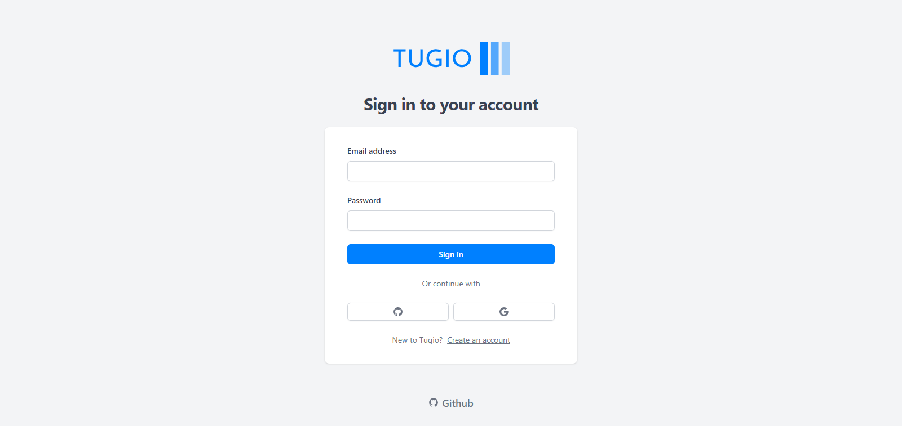
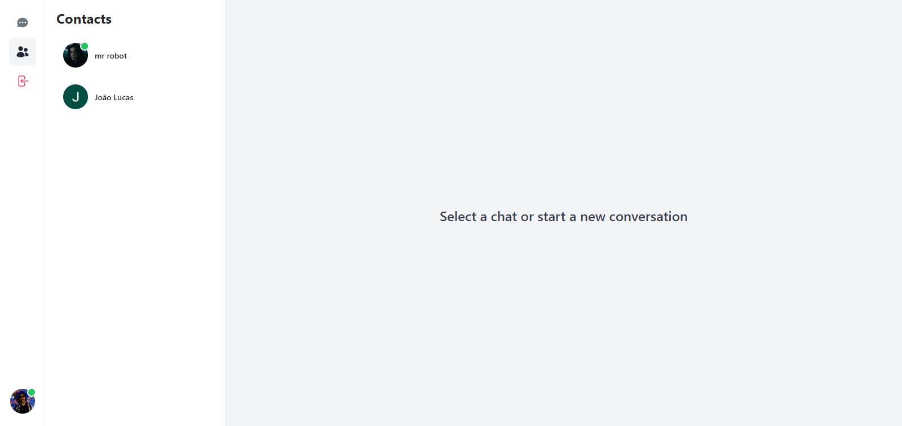
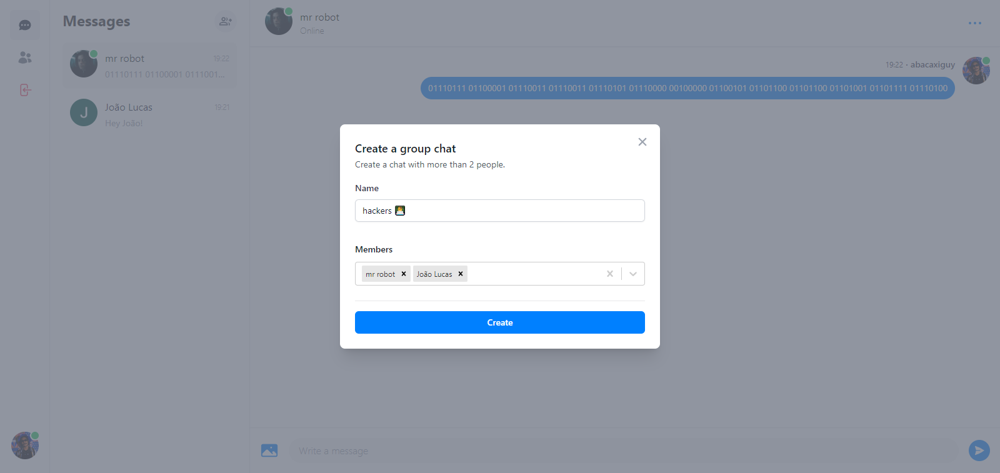
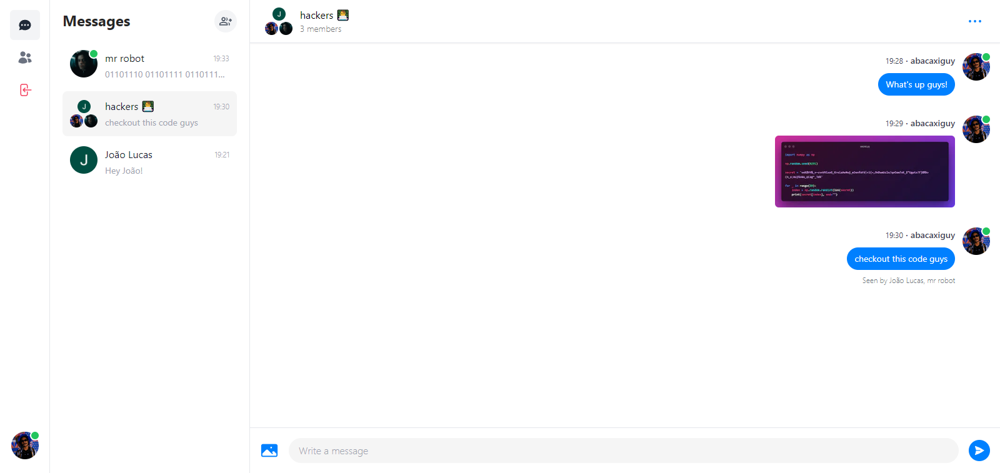
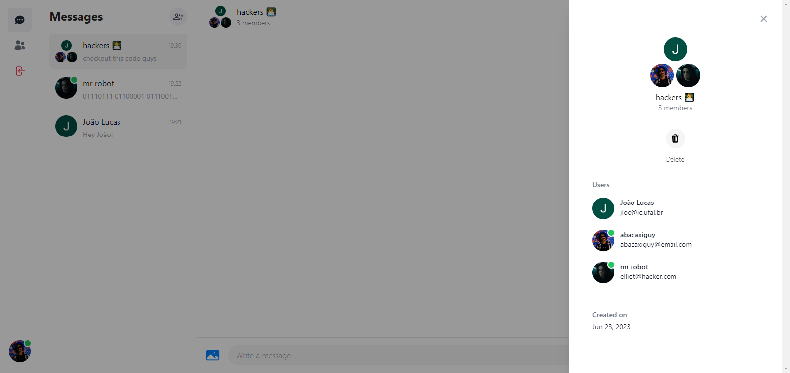

<br>
<div align="center">
  <p>
    
  </p>

# 📲 Tugio, Your instant messaging app with Next.js and Prisma ⚛

</div>

<p align="center">
  
  
  <a href="https://github.com/abacaxiguy" target="_blank"></a>
</p>

<br>

<p align="center">
  
  <!-- 
  
  
   -->
</p>

## 🧪 Technologies

This project was developed using the following technologies and libraries:

<a href="https://nextjs.org/"></a>
<a href="https://www.typescriptlang.org/"></a>
<a href="https://tailwindcss.com/"></a>
<a href="https://www.prisma.io/"></a>
<a href="https://pusher.com/"></a>

---

## 🚀 How to run

To run this in your local machine, clone this repo and run the command:

```sh
  # Installing dependencies
  pnpm install
```

installing all dependencies. After that, just start:

```sh
  # Starting project
  pnpm dev
```

And it will appear on `http://localhost:3000`.

**⚠ Also, make sure to fill the info needed in a .env file using the [.env.example](https://github.com/abacaxiguy/tugio/blob/main/.env.example) file as an example ⚠**

_Remembering that you will need to create a database on [MongoDB](https://www.mongodb.com/), an account on [Google Cloud Platform](https://cloud.google.com/), create credentials at [Github OAuth](https://docs.github.com/en/developers/apps/building-oauth-apps/creating-an-oauth-app), create an account on [Cloudinary](https://cloudinary.com/) and create an account on [Pusher](https://pusher.com/) so you can fill the .env file with the info needed._

---

## 📣 Credits

This project was made by [@Code With Antonio](https://github.com/AntonioErdeljac) in the video [Real-Time Messenger Clone](https://www.youtube.com/watch?v=PGPGcKBpAk8).

So, all the credits for the original project goes to him, I just made some changes to the original project, and I will keep updating this project with new features, so if you want to contribute, feel free to check the [issues page](https://github.com/abacaxiguy/tugio/issues).

---

## 🎨 Design

My original tugio design, including logos and icons, is here on figma:

<a href="https://www.figma.com/community/file/1253508613711229267"></a>

---

## 🤝 Contributing

Contributions, issues and feature requests are welcome!<br />Feel free to check [issues page](https://github.com/abacaxiguy/tugio/issues).

---

## 📜 License

Copyright © 2023 [João Lucas](https://github.com/abacaxiguy).<br />
This project is licensed under the [MIT](https://github.com/abacaxiguy/tugio/blob/main/LICENSE) license.

---

<h4  align="center">Developed by 🍍</h4>
